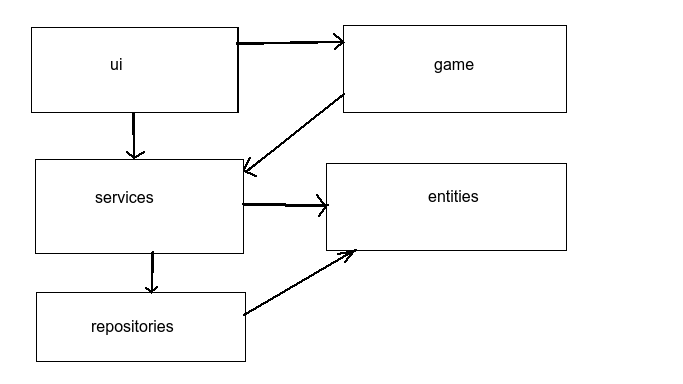
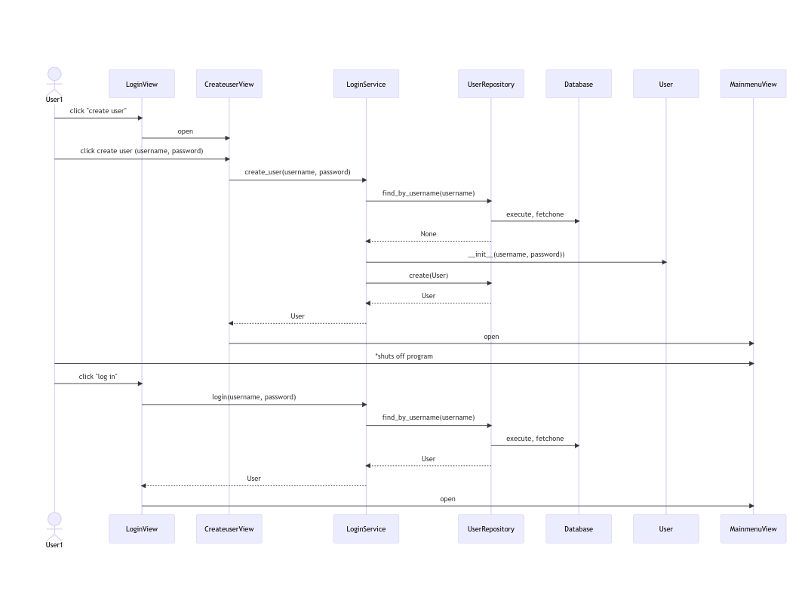
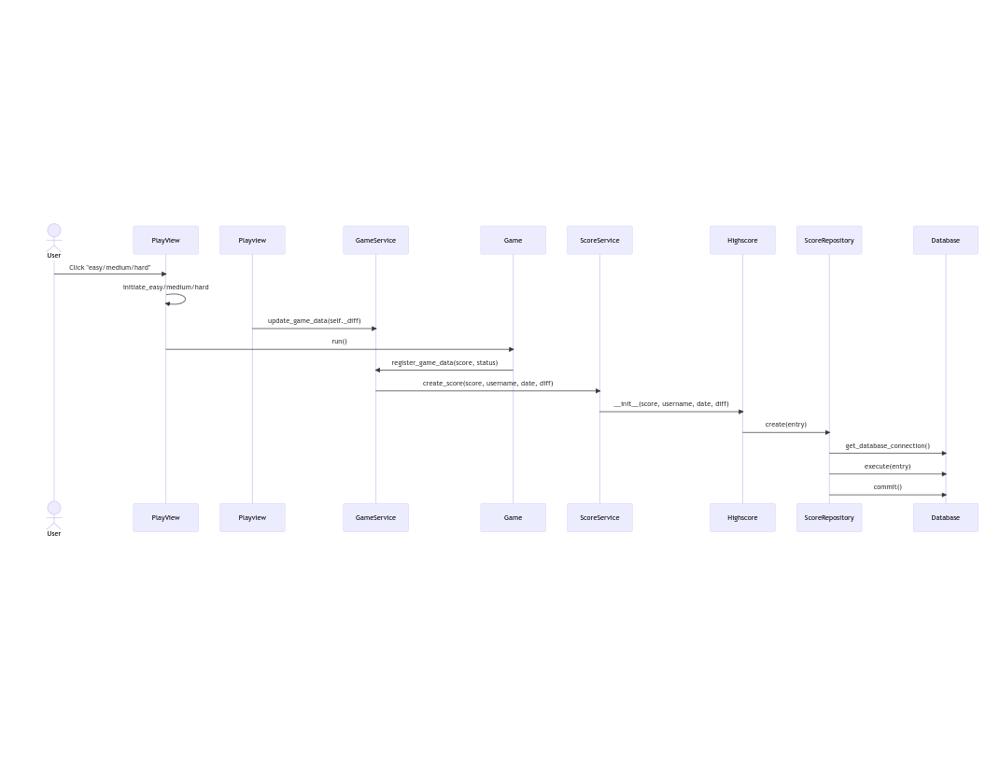
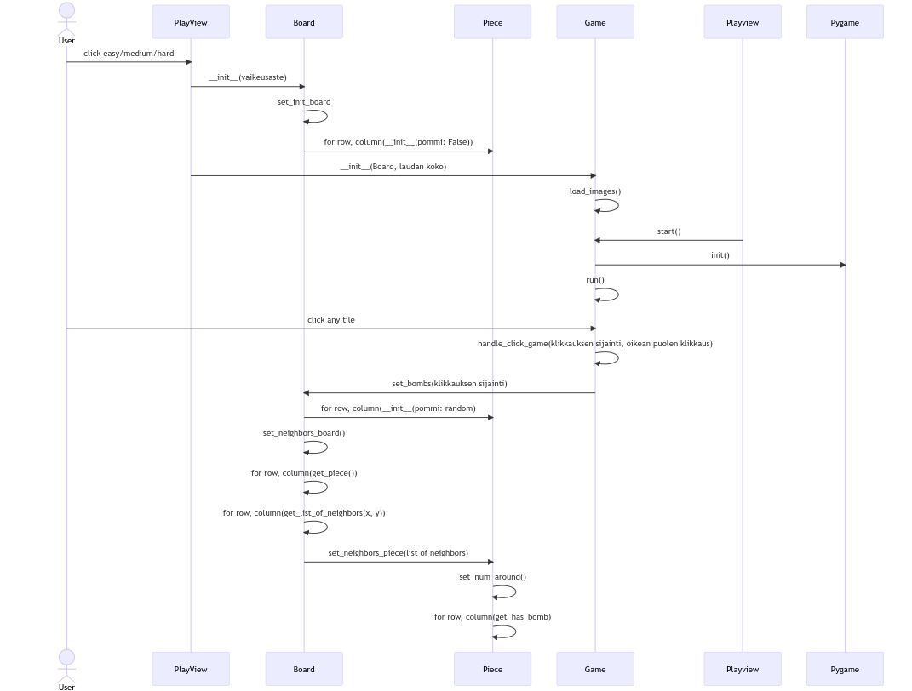
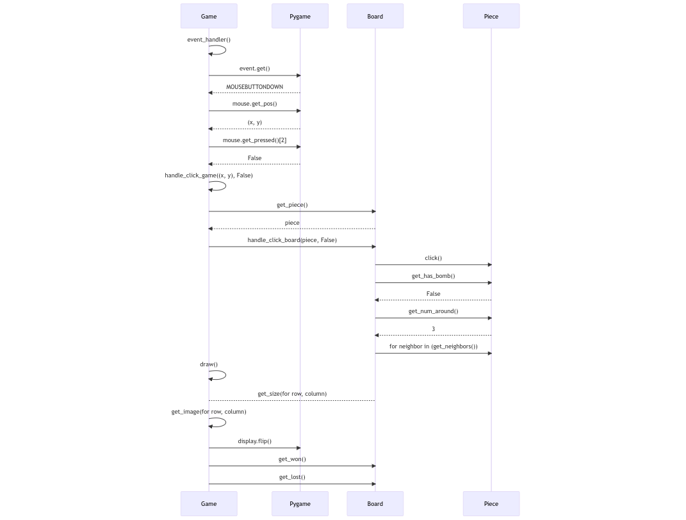

# Arkkitehtuurikuvaus

## Rakenne

Sovelluksen rakenne noudattaa karkeasti alla olevaa kaavaa:

Yksikkö _ui_ sisältää käyttöliittymän koodin, _services_ sovelluslogiikan koodin ja _repositories_ tietojen pysyväistallennuksesta vastaavan koodin. Pakkaus _entities_ sisältää luokat, jotka määrittävät sovelluksen käyttämät tietokohteet. Pakkaus _game_ on eritelty omaksi yksikökseen, mutta toimii samalla periaatteella kuin yksikkö __ui__. 

## Käyttöliittymä

Käyttöliittymä sisältää seuraavat näkymät:

- Kirjautuminen
- Uuden käyttäjän luominen
- Alkuvalikko
- Pelin vaikeusasteen valitseminen
- Pelinäkymä
- 3 Parhaat tulokset näkymää (helppo, keskitaso, vaikea)

Jokainen näkymä on toteutettu omana luokkanaan ja eristetty pääosin sovelluslogiikasta. Näkymien näyttämisestä vastaa [UI](../src/ui/ui.py)-luokka. 

## Sovelluslogiikka

Sovelluslogiikan selkärangan muodostavat luokat `User` ja `Highscore` , jotka kuvaavat käyttäjän tietoja sekä käyttäjän pelisuorituksia.

- Luokan `User` argumentit ovat __username__ (käyttäjätunnus) ja __password__ (salasana).
- Luokan `Highscore` argumentit ovat __score__ (pelin tulos), __user__ (tuloksen saanut käyttäjä), __date__ (tuloksen saavutuspäivämäärä) sekä __diff__ (vaikeusaste, jolla tulos on saavutettu). 

## Tietojen pysyväistallennus

Hakemiston __repositories__ luokat `UserRepository` ja `ScoreRepository` vastaavat tietojen pysyväistallennuksesta. Tallennuksen kohteena on molemmissa luokissa SQLite-tietokanta. 

## Päätoiminnallisuudet

### Käyttäjän luominen ja kirjautuminen

Valitsemalla kirjautumisnäkymässä "create user", järjestelmä luo uuden käyttäjän, sekä hoitaa myöhemmät kirjautumiset samalle käyttäjälle seuraavasti:

### Tuloksen luominen

Valitsemalla vaikeusaste -näkymästä pelin vaikeusasteen, peli käynnistyy, ja pelin tiedot siirtyvät ja tallentuvat pelin kuluessa seuraavasti:

### Pelin alustaminen

Valitsemalla vaikeusaste -näkymästä pelin vaikeusasteen, peli käynnistyy, ja peliruudukko alustetaan seuraavasti:

Jotta ensimmäinen klikkaus ei osuisi pommiin, lauta alustetaan ensin pelkästään tyhjillä ruuduilla. Kun pelaaja klikkaa mistä tahansa ruudusta, pelilauta alustetaan uudestaan siten, että vaikeusasteen mukainen määrä pommeja jaetaan satunnaisiin peliruutuihin, poslukien pelaajan alussa klikkaama ruutu. 

### Pelin pelaaminen

Kilikkaamalla pelin ollessa auki tyhjää ruutua, pelin logiikasta vastaavat luokat käsittelevät siirron seuraavasti:

