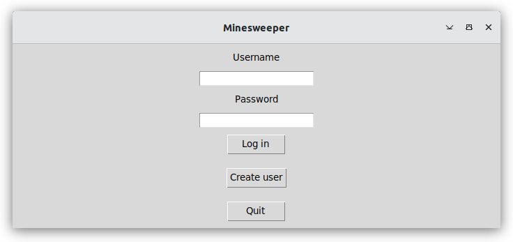

# Käyttöohje

Lataa sovelluksen viimeisin versio [täältä](https://github.com/ohjelmistotekniikka-hy/python-todo-app/releases) kohdasta _Source code_.

## Ohjelman käynnistäminen

Ennen ohjelman käynnistämistä, asenna riippuvuudet komennolla:

```bash
poetry install
```

Jonka jälkeen suorita alustustoimenpiteet komennolla:

```bash
poetry run invoke build
```

Nyt ohjelman voi käynnistää komennolla:

```
poetry run invoke start
```

## Kirjautuminen

Sovellus käynnistyy kirjautumisnäkymään:



Kirjaudu antamalla käyttäjätunnus ja salasana, jonka jälkeen paina "Login"-nappia.

## Uuden käyttäjän luominen

Voit luoda uuden käyttäjän painamalla "Create user".

Anna haluamasi käyttäjänimi ja salasana, jonka jälkeen paina "Create"-nappia:


Jos saman niminen käyttäjä on jo luotu aiemmin, joudut keksimään toisen käyttäjänimen. Kun olet luonut käyttäjäm, kirjaudut sisään automaattisesti. 

## Alkuvalikko

Voit siirtyä alkuvalikosta pelaamaan "Play"-napista tai tarkastella parhaita tuloksia "High scores"-napista:


## Vaikeusasteen valitseminen

Ennen pelin alkua sinun tulee valita vaikeusaste helpon ("easy"), keskitason ("medium") ja vaikean ("hard") välillä:


Mitä vaikeamman pelin valitset, sitä suurempi pelialue on, ja sitä enemmän miinoja pelialueelle on piilotettu

## Pelinäkymä

Pelin tavoite on klikata auki mahdollisimman nopeasti kaikki sellaiset ruudut, joiden alle ei ole piilotettu pommia. Jos klikkaat auki ruudun jonka alla on pommi, häviät pelin. 


Jos avaat ruudun jonka alta paljastuu numero, saat tietää, että avattua ruutua ympäröi numeron mukainen määrä pommeja. 

Jos tiedät, että jonkin ruudun alla on pommi, voit merkata ruudun lipulla klikkaamalla ruutua hiiren oikenpuoleisella painikkeella. 

Ensimmäistä avaamaasi ruutua lukuunottamatta et voi alussa tietää mihin pommit ovat piilotettu. Ruutuja avaamalla saat tietoa vapaiden ruutujen sekä pommien sijainneista. 
