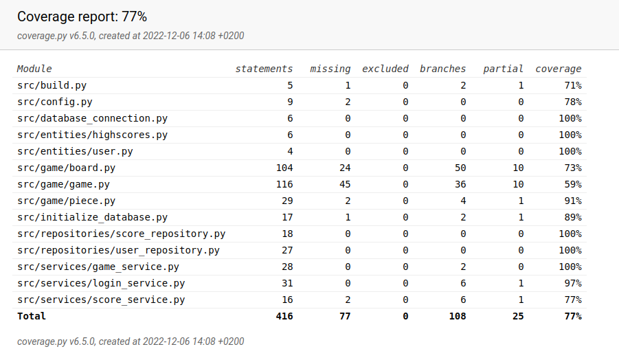

# Testausdokumentti

Ohjelmaa on testattu yksikkö- ja integraatiotesteillä unittestin avulla, sekä manuaalisesti järjestelmätason testeillä.

## Yksikkö- ja integraatiotestaus

### Sovelluslogiikka (käyttöliittymä)

Käyttöliittymän sovelluslogiikasta vastaavia `LoginService` ja `ScoreService` -luokkia testataan [TestLoginService](https://github.com/hakkajoe/ot-harjoitusty-/blob/master/src/tests/services/login_service_test.py) ja [TestScoreService](https://github.com/hakkajoe/ot-harjoitusty-/blob/master/src/tests/services/score_service_test.py)-testiluokilla.

### Sovelluslogiikka (peli)

Pelin sovelluslogiikkaa vastaavaa `Game`-luokkaa testataan luokassa [TestGame](https://github.com/hakkajoe/ot-harjoitusty-/blob/master/src/tests/game/game_test.py)

### Repositorio-luokat

Repositorio-luokkia `ScoreRepository` ja `UserRepository` testataan luokissa [TestHighscoreRepository](https://github.com/hakkajoe/ot-harjoitusty-/blob/master/src/tests/repositories/highscore_repository_test.py) sekä [TestUserRepository](https://github.com/hakkajoe/ot-harjoitusty-/blob/master/src/tests/repositories/user_repository_test.py)

### Testauskattavuus

Käyttöliittymäkerrosta lukuunottamatta sovelluksen testauksen haarautumakattavuus on 77%

Haarautumaraportin ulkopuolelle on jätetty käyttöliittymästä vastaava dokumentaatio, poislukien käyttöliittymän logiikka. 

## Järjestelmätestaus

Sovelluksen järjestelmätestaus on suoritettu manuaalisesti siten, että kaikki [määrittelydokumentin](./vaatimusmaarittely.md) ja käyttöohjeen listaamat toiminnallisuudet on käyty läpi. Sovelluksen reagoiminen myös virheellisiin syötteisiin on testattu.

## Sovellukseen jääneet laatuongelmat

Pelistä vastaavaa logiikkaa ei ole hajautettu tarpeeksi optimaalisen testikattavuuden saavuttamiseksi. 
